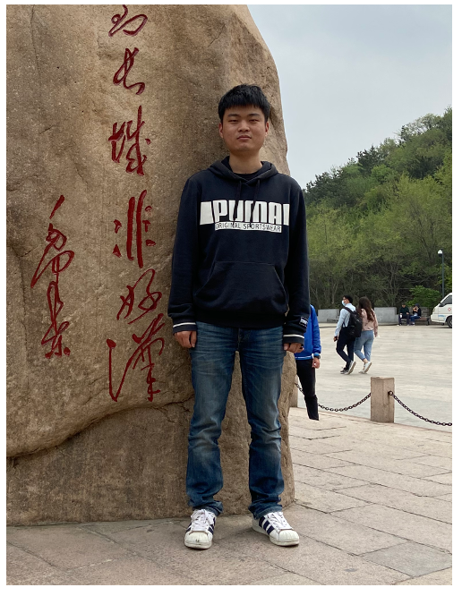
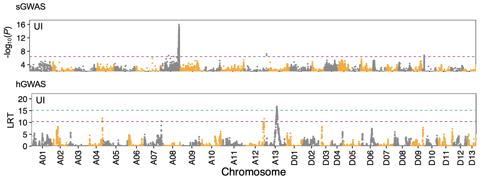

# Content

- Education background
- Current research achievement
- Fulture research interests

---

# Education

2020 - present, HZAU, Ph.D. candidate

2016 - 2019, HZAU, Master's Degree

2012 - 2016, HZAU, Bachelor's Degree

---
# Background

- Cotton contains 45 diploids with 8 karyotypes (A-G and K) and 7 allopolyploids (AD)
- Only four species were domesticated as cultivated cottons (A1, A2, AD1 and AD2)

---
# Questions

1. What genetic factors influence the fiber quality of upland cotton? 
2. Why only A genome has spinnable fibers in diploids?
3. Why allotetraploids have better fiber quality than diploids?

---

# Project 1

I completed most of the figures and wrote the paper

---

# Main results

1. Performed two complementary GWAS method
2. Detect prevalent epistatic interactions

---

# What I have learnt

the main approaches for studying complex traits
- GWAS and linkage mapping
- IBD inference
- heritability
- epistasis

---

# Project 2

Contribution: figs5,6

---

# Experimental design

- Re-sequence 216 diploid cotton accessions
- RNA-seq for 5 time-points for each accession
- Perform GWAS and eQTL analysis

---

# Why perform eQTL analysis?

- provide a reliable molecular link between DNA variants and complex phenotypes
- prioritize causal genes at GWAS loci 

---

# eQTL hotspot

- a regulatory hotspot overlapped with a FL-related QTL (FL5)
- the genes were enriched in the biological processes plant-type cell wall organization and protein transport

---

# Why A genome has spinnable fibers?

- syntenic analysis of functional genes
- An example showing two tandem duplication genes for FL 

---

# Project 3

Contribution: part of figs.2,3, and entire fig.6

---

# GWAS and TWAS analysis

Conduct GWAS of fiber quality and found 18 QTLs
Perform TWAS and found 1255 genes associated with fiber quality

---

# cotton breeding strategy

- we can further improve fiber quality by targeting one of the less favourably expressed gene in the homologous gene pairs.

---
# What I have learnt

Post-GWAS analysis
- prioritization of variants in the non-coding regions
- Construction of GS model

---

# Two more projects

- domestication
- pan-genome of 75 accessions 

---

# Summary

- I know many details about quantitative genetics.
- I am good at bioinformtics workflow construction and downstream analysis.

---

# Future research interests

- employ a state-of-the-art multiomics approach to understand the evolution of interestiong phenotypes in cucurbits
- perform mGWAS, eQTL as well as functional case-studies to decipher the genetic basis of key agronomic traits in cucurbits

---

<!-- _class: lead -->

# END.

