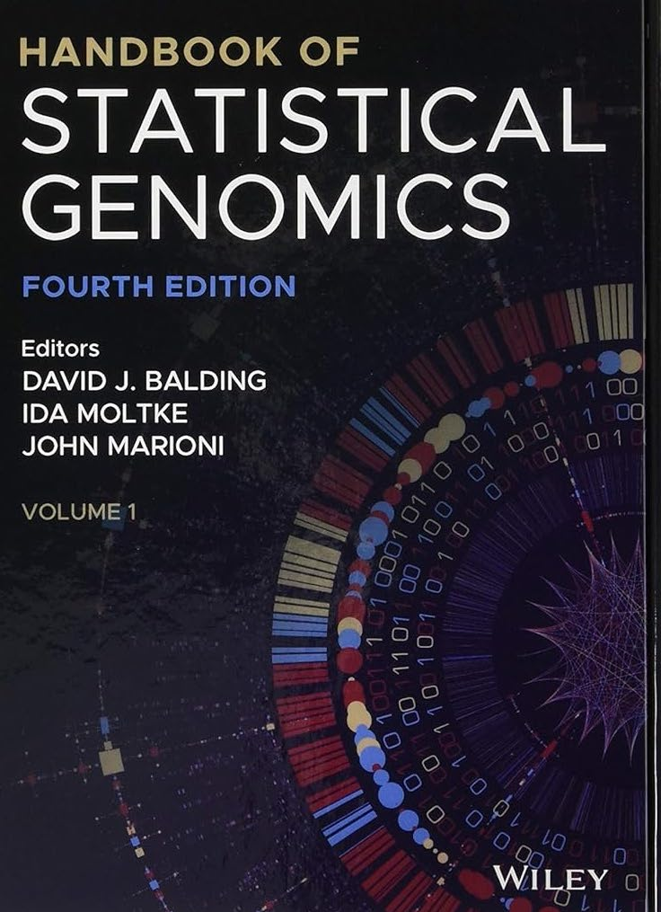

# Content

- Education background
- Current research achievement
- Fulture research interests

---

# Education

2020 - present, HZAU, Ph.D. candidate

2016 - 2019, HZAU, Master's Degree

2012 - 2016, HZAU, Bachelor's Degree

---
# Background

- Cotton contains 45 diploids and 7 allopolyploids (AD)
- 4 species were domesticated as cultivars (A1, A2, AD1 and AD2)

---
# Questions

1. What genetic factors influence the fiber quality of upland cotton? 
2. Why only A genome has spinnable fibers in diploids?
3. Why allotetraploids have better fiber quality than diploids?

---

# Project 1

I performed data analysis and wrote the manuscript.

---

# Main results

1. Performed two complementary GWAS method
2. Detect prevalent epistatic interactions

---

# What I have learnt

The main approaches for studying complex traits
- GWAS and linkage mapping
- IBD inference
- heritability
- epistasis

---

# Project 2

Contribution: 1/3 analysis tasks (figs5,6)

---

# Experimental design

- Re-sequence 216 diploid cotton accessions
- RNA-seq for 5 time-points for each accession
- Perform GWAS and eQTL analysis

---

# Why perform eQTL analysis?

- Provide a reliable molecular link between DNA variants and complex phenotypes
- Prioritize causal genes at GWAS loci 

---

# Networking of genes

- A regulatory hotspot overlapped with a GWAS locus of FL
- The 52 genes regulated by the hotspot were involved in the processes of plant-type cell wall organization and protein transport

---

# Why A genome has spinnable fibers?

- Performed syntenic analysis of 195 putative functional genes
- The left figure serves as an example, illustrating the PAV of two tandem duplication genes was associated with fiber evolution

---

# Project 3

Contribution: 1/3 analysis tasks (part of figs.2,3, and entire fig.6)

---

# GWAS and TWAS analysis

- Conducted GWAS of fiber quality and found 18 QTLs
- Performed TWAS and found 1255 genes associated with fiber quality

---

# Cotton breeding strategy

- We can further improve fiber quality by targeting one of the less favourably expressed gene in the homologous gene pairs.

---
# What I have learnt

Post-GWAS analysis
- Prioritization of variants in the non-coding regions
- Construction of GS model

---

# Two more projects

- Domestication/breeding history of upland cotton
- Pan-genome analysis of 75 accessions (15 diploids and 60 tetraploids)

---

# Summary

- I know many details about quantitative genetics.
- I am good at bioinformtics workflow construction and downstream analysis.

---

# Future research interests

- Understand the evolution of interesting phenotypes by employing a state-of-the art multi-omics approach
- Deciper the genetics basis of key agronomic traits by using statistical genetics and functional case-studies

---

# Acknowledgement

- National Key Laboratory of Crop Genetic Improvement
- High-performance computing platform in HZAU
- Dr. Wang's research group

---

<!-- _class: lead -->

# Thanks
qizhengyang17@qq.com

